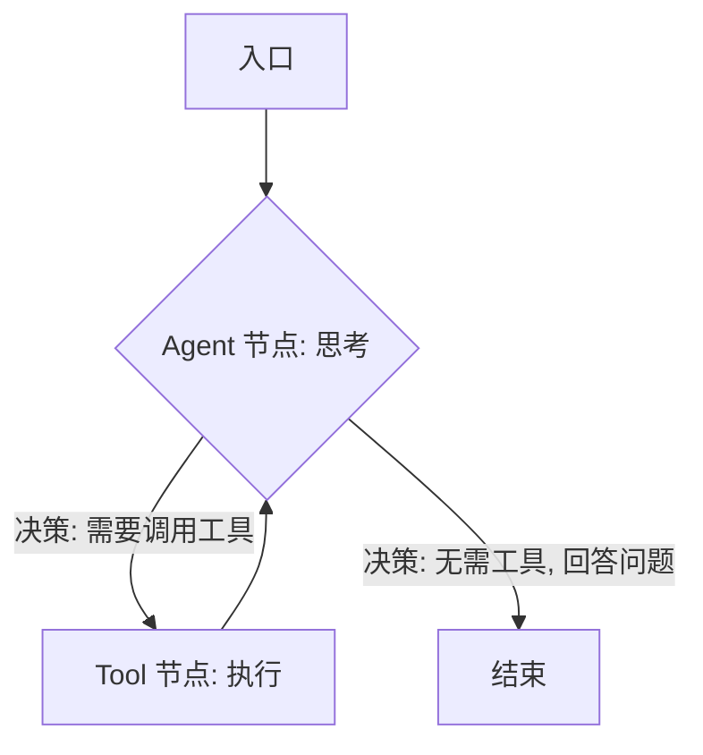
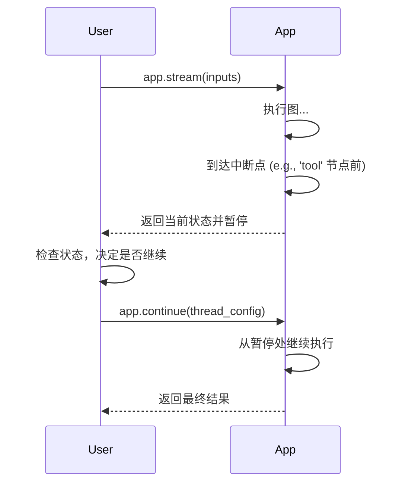

# LangGraph 进阶指南

这份指南将带你探索 LangGraph 的一些高级功能，让你能够构建更复杂、更强大的 Agent。

---

## 1. 管理对话历史与复杂状态

在基础示例中，我们每次都直接更新状态值。但这在处理对话历史（一个消息列表）时会产生问题。

**问题：** 默认情况下，节点返回的字典会直接 `update` 到主状态上。如果状态里有一个 `messages` 列表，而节点返回一个新的 `messages` 列表，那么旧的列表会被完全**替换**，而不是**追加**。

**解决方案：** 使用 `typing.Annotated` 来告诉 LangGraph 如何合并状态更新。

#### 更新方式对比

| 更新方式 | 行为 | 示例 | LangGraph 实现 |
| :--- | :--- | :--- | :--- |
| **默认 (Update)** | 替换整个值 | `state['messages'] = new_messages` | `messages: list` |
| **追加 (Add)** | 追加到列表末尾 | `state['messages'].extend(new_messages)` | `messages: Annotated[list, operator.add]` |

### 代码示例：正确地累积消息

我们需要 `operator.add`，它在处理列表时等同于 `list.extend`。

```python
import operator
from typing import TypedDict, Annotated
from langchain_core.messages import AnyMessage

# 使用 Annotated 和 operator.add 来告诉 LangGraph
# 对 messages 字段的更新应该是“追加”而不是“替换”
class AgentState(TypedDict):
    messages: Annotated[list[AnyMessage], operator.add]

# 之后，在你的节点中，你只需要返回一个包含新消息的列表
# LangGraph 会自动帮你完成追加操作
# def my_node(state: AgentState):
#     # ... some logic ...
#     new_message = AIMessage(content="Hello!")
#     return {"messages": [new_message]} # 返回列表
```

这个小小的改动是构建能够记忆对话历史的 Agent 的基石。

---

## 2. 构建真正的 Agentic Loop (循环)

真正的 Agent 需要在“思考 -> 行动”之间循环，直到任务完成。这意味着图需要有**环**。

### 循环流程图

下面是一个典型的 Agent 循环的流程图：



**关键在于条件边 `B`**。它在 Agent 思考后，判断下一步是去调用工具、直接结束，还是继续思考。

### 代码示例：一个带循环的 Agent

这个例子会模拟一个 LLM，它可以决定是否调用一个（假的）搜索工具。如果调用了，它会处理工具结果并再次思考。

```python
import operator
from typing import TypedDict, Annotated
from langgraph.graph import StateGraph, END
from langchain_core.messages import AnyMessage, BaseMessage, HumanMessage, AIMessage, ToolMessage

# 1. 使用我们学到的 Annotated 来定义状态
class AgentState(TypedDict):
    messages: Annotated[list[AnyMessage], operator.add]

# 2. 定义假的工具和 LLM
def fake_search_tool(query: str):
    """一个假的搜索工具"""
    print(f"--- Tool: 正在搜索 '{query}' ---")
    return f"关于 '{query}' 的搜索结果是：LangGraph 很强大！"

def fake_llm(messages: list[BaseMessage]):
    """一个假的 LLM, 模拟工具调用"""
    print("--- Agent: 正在思考... ---")
    last_message = messages[-1]
    if isinstance(last_message, ToolMessage):
        return AIMessage(content="哦，我已经拿到工具返回的结果了。最终答案是：LangGraph 非常强大！")

    # 首次接收到问题时，模拟决定调用工具
    question = last_message.content
    return AIMessage(
        content="我需要用工具来查找答案。",
        tool_calls=[{"name": "fake_search_tool", "args": {"query": question}, "id": "123"}]
    )

# 3. 定义节点
def agent_node(state: AgentState):
    """调用 LLM 进行思考"""
    response = fake_llm(state['messages'])
    return {"messages": [response]}

def tool_node(state: AgentState):
    """执行工具调用"""
    last_message = state['messages'][-1]
    tool_call = last_message.tool_calls[0]
    result = fake_search_tool(**tool_call['args'])
    return {"messages": [ToolMessage(content=result, tool_call_id=tool_call['id'])]}

# 4. 定义路由逻辑
def router(state: AgentState):
    """根据 LLM 的最新回复决定下一步"""
    last_message = state['messages'][-1]
    if last_message.tool_calls:
        # 如果有工具调用，则路由到 tool 节点
        return "tool"
    else:
        # 否则，结束
        return "__end__" # 使用 __end__ 而不是 END

# 5. 构建图
workflow = StateGraph(AgentState)
workflow.add_node("agent", agent_node)
workflow.add_node("tool", tool_node)

workflow.set_entry_point("agent")
workflow.add_conditional_edges("agent", router)
workflow.add_edge("tool", "agent") # <-- 这就是循环的关键！Tool 执行完返回 Agent

app = workflow.compile()

# 6. 运行图
inputs = {"messages": [HumanMessage(content="什么是 LangGraph?")]}
for s in app.stream(inputs, {"recursion_limit": 5}):
    print(s['messages'][-1])
    print("----------------")
```

在这个例子中，`tool_node` 执行完毕后，边会把它指回 `agent_node`，形成了一个完美的循环。

---

## 3. 加入人工干预 (Human-in-the-Loop)

有时候，我们希望 Agent 在执行关键步骤（比如执行一个会修改文件的工具）前暂停，等待用户的批准。

**实现方式：** 在编译图时，使用 `checkpointer` 和 `interrupt_before`。

-   **Checkpointer**: 一个用于保存图状态的对象。最简单的是 `MemorySaver`。
-   **interrupt_before**: 一个节点名称列表，图在执行这些节点**之前**会暂停。

### 流程图



### 代码示例

我们可以在上一个例子的基础上，增加一个中断。

```python
# ... (复用上一个例子的所有定义) ...

from langgraph.checkpoint.memory import MemorySaver

# 在编译时加入 checkpointer 和 interrupt
# 这意味着在执行 "tool" 节点前，图会暂停
memory = MemorySaver()
app = workflow.compile(checkpointer=memory, interrupt_before=["tool"])

# 运行图
inputs = {"messages": [HumanMessage(content="什么是 LangGraph?")]}

# thread_config 用于标识一个独立的会话
thread_config = {"configurable": {"thread_id": "my-thread-1"}}

print("--- 开始执行 ---")
for s in app.stream(inputs, thread_config, {"recursion_limit": 5}):
    print(s['messages'][-1])
    print("----------------")

# 此时，图已经暂停。我们可以检查当前状态
current_state = app.get_state(thread_config)
last_message = current_state.values['messages'][-1]
print(f"\n图已暂停。Agent 准备调用工具: {last_message.tool_calls[0]['name']}")

# 等待用户输入 (这里我们直接模拟)
# input("按回车键继续...")

print("\n--- 继续执行 ---")
# 使用 app.continue() 继续执行
for s in app.stream(None, thread_config, {"recursion_limit": 5}):
    print(s['messages'][-1])
    print("----------------")
```

这个功能对于构建需要用户监督或交互的、可靠的 Agent 至关重要。

---

## 总结

通过掌握状态管理、循环和人工干预，你已经具备了使用 LangGraph 构建复杂、实用和可靠的 Agent 的能力。下一步，你可以尝试将这些示例中的“假”组件换成真实的 LLM 和工具，来解决真实世界的问题。
