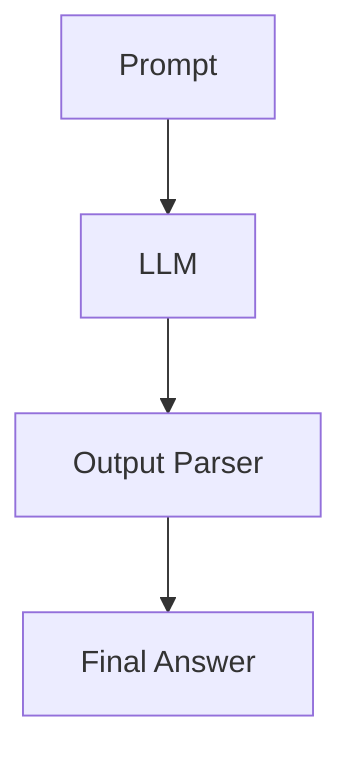
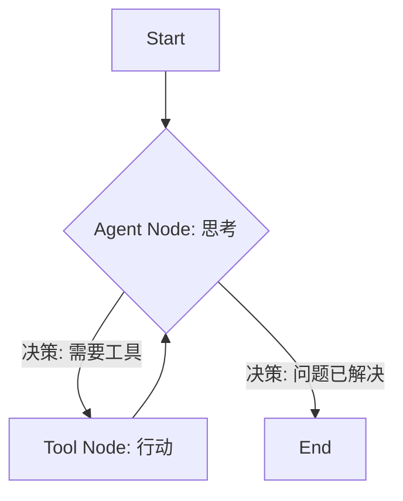

# 阶段一：核心概念 | 1.1. LCEL vs. LangGraph

**目标：** 理解 LangChain 表达式语言 (LCEL) 的核心优势及其“无环”的本质局限，并明白 LangGraph 为何是构建复杂 Agent 的必然选择。

---

## 什么是 LCEL (LangChain Expression Language)？

LCEL 是 LangChain 的核心，它提供了一种声明式的方式来**链式组合**各种组件（如 LLM、Prompt、输出解析器、工具等）。你可以把它想象成一条数据处理的“管道”。

```python
# 一个典型的 LCEL 链
chain = prompt | llm | output_parser
```

### LCEL 的核心优势

1.  **流式处理 (Streaming):** 可以将最终结果一块一块地流式返回，而不是等待所有计算完成后一次性返回，极大地提升了用户体验。
2.  **异步与并行 (Async & Parallel):** 天然支持异步操作，并且可以轻松地并行执行链中的多个部分。
3.  **日志与调试:** 与 LangSmith 无缝集成，每一步的输入输出都清晰可见。
4.  **可配置性:** 可以轻松配置链中的各个环节。

### LCEL 的核心结构：有向无环图 (DAG)

LCEL 的本质是一个 **有向无环图 (Directed Acyclic Graph, DAG)**。数据从一个方向流入，经过一系列处理后，从另一个方向流出。就像一条单行道，你不能掉头或绕圈。


*图1: LCEL 链的本质是一个简单的 DAG*

---

## LCEL 的局限：为何它不够用？

LCEL 的“无环”特性在处理线性任务时非常高效，但当我们需要构建一个真正的 **Agent** 时，这个限制就变得非常突出。

**Agent 的核心是“思考-行动”循环 (Think-Act Loop)。**

一个 Agent 的工作流程通常是这样的：
1.  接收用户问题。
2.  **思考**: 调用 LLM，分析问题。
3.  **决策**: LLM 判断是否需要使用工具。
4.  **行动**: 如果需要，就调用工具。
5.  **观察**: 将工具返回的结果提供给 LLM。
6.  LLM 根据新信息再次**思考**，可能决定调用另一个工具，或者生成最终答案。

这个过程包含了**循环**——流程可能会在“思考”和“行动”之间往复多次。这在 LCEL 的 DAG 结构中是无法实现的。

---

## LangGraph 的解决方案：引入状态和循环

LangGraph 正是为了解决 LCEL 的“无环”限制而生。它通过引入两个核心概念，将数据管道升级为了一个真正的、可控的流程图：

1.  **持久化的状态 (State):** 在整个图的执行过程中，有一个所有节点都可以读写的共享“内存”（State 对象）。这使得信息可以在图的任意两个节点之间传递，而不仅仅是相邻节点。

2.  **条件边 (Conditional Edges):** 允许你根据当前的状态，动态地决定下一步要去哪个节点。这使得“循环”和“分支”成为可能。

### LangGraph 的结构：有向循环图

使用 LangGraph，我们可以轻松地构建出 Agent 所需的循环流程。


*图2: LangGraph 允许创建带循环的图，完美匹配 Agent 逻辑*

### 总结对比

| 特性 | LCEL (LangChain Expression Language) | LangGraph |
| :--- | :--- | :--- |
| **核心结构** | 有向无环图 (DAG) | 有向图 (可以有环) |
| **数据流** | 线性，单向 | 多向，由状态和边决定 |
| **状态管理** | 无内置的持久化状态 | **核心特性**，有共享的状态对象 |
| **控制流** | 静态，预定义 | **动态**，可通过条件边改变 |
| **最适用场景** | 数据处理、RAG、简单的 LLM 调用链 | **构建 Agent**、多步推理、人机协作 |

**结论：**

-   **LCEL** 是构建 LLM 应用的“砖块”和“管道”。
-   **LangGraph** 则是使用这些“砖块”和“管道”来搭建一整座能够自主思考、行动和循环的“工厂”。

当你需要构建一个不仅仅是“一步到位”的链，而是需要一个能够根据情况做出判断、多次使用工具、与用户交互的复杂应用时，LangGraph 就是你的不二之选。
