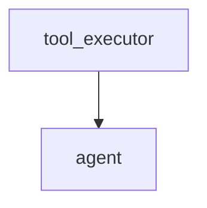
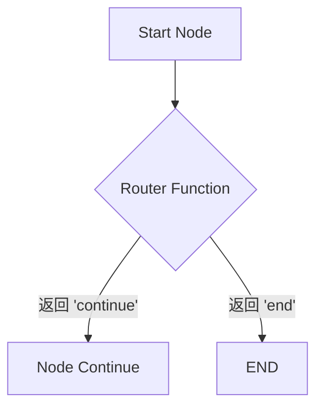

# 阶段一：核心概念 | 2.3. 详解核心组件：Edges

**目标：** 掌握 LangGraph 中控制工作流方向的两种“边”（Edges），并重点理解条件边（Conditional Edges）如何实现动态路由，赋予图“智能”。

---

## Edges: 图的“流程控制器”

如果说 Nodes 是图的“工人”，那么 Edges 就是指挥工人按何种顺序工作的“工头”。边连接着节点，定义了在执行完一个节点后，工作流应该走向何方。

LangGraph 主要有两种类型的边：
1.  **常规边 (Normal Edges):** `A -> B` 的固定路线。
2.  **条件边 (Conditional Edges):** `A -> ?`，根据当前状态决定去 `B` 还是 `C`。

此外，还有两个特殊的“伪边”概念：
-   **入口点 (Entry Point):** 告诉图从哪里开始。
-   **结束点 (END):** 告诉图在哪里结束。

--- 

## 1. 入口点 (Entry Point)

每个图都必须有一个明确的起点。`set_entry_point()` 方法就是用来指定这个起点的。

```python
# workflow.set_entry_point("agent")
```

这行代码告诉 LangGraph：“当这个工作流启动时，第一个要执行的节点是名为 `agent` 的节点。”

--- 

## 2. 常规边 (Normal Edges)

常规边是最简单的连接方式，它定义了一个固定的、无条件的流向。

**API:** `workflow.add_edge(start_node_name: str, end_node_name: str)`

**含义:** “当名为 `start_node_name` 的节点执行完毕后，下一个**总是**执行名为 `end_node_name` 的节点。”

**示例:**

```python
# workflow.add_edge("tool_executor", "agent")
```

这在构建 Agentic Loop 时非常常见，意味着工具执行完后，流程**总是**返回给 Agent 节点，让 Agent 根据工具结果进行下一步思考。



--- 

## 3. 条件边 (Conditional Edges)

条件边是 LangGraph 最强大的功能之一，它让图具备了动态决策的能力。

**API:** `workflow.add_conditional_edges(start_node_name: str, router_function: Callable, path_map: dict)`

**含义:** “当名为 `start_node_name` 的节点执行完毕后，调用 `router_function`。`router_function` 会返回一个字符串，我们根据这个字符串去 `path_map` 中查找对应的下一个节点是哪里。”

### 条件边的三个核心要素

1.  **起始节点 (`start_node_name`):** 决策从哪个节点之后开始。
2.  **路由函数 (`router_function`):**
    -   这是一个你定义的 Python 函数。
    -   它和普通节点一样，接收当前的**状态 (State)** 作为唯一参数。
    -   它**必须返回一个字符串**。这个字符串就是决策的结果。
3.  **路径图 (`path_map`):**
    -   这是一个字典。
    -   它的 `key` 是路由函数可能返回的字符串。
    -   它的 `value` 是对应的下一个节点的名称。

### 可视化流程



### 代码示例

```python
from typing import Literal

# 假设我们有 AgentState
# class AgentState(TypedDict):
#     next_action: Literal["tool", "end"]
#     ...

# 1. 定义路由函数
def should_continue(state: AgentState) -> Literal["tool", "end"]:
    """读取状态，决定下一步去哪里"""
    if state["next_action"] == "tool":
        print("决策：调用工具")
        return "tool"
    else:
        print("决策：结束")
        return "end"

# 2. 定义路径图
path_map = {
    "tool": "tool_executor_node", # 如果路由函数返回 "tool", 则去 tool_executor_node
    "end": END                   # 如果返回 "end", 则结束 (END 是一个特殊常量)
}

# 3. 在图构建中添加条件边
# workflow.add_conditional_edges(
#     "agent",           # 决策在 agent 节点后
#     should_continue,   # 使用 should_continue 函数做决策
#     path_map           # 使用 path_map 查找路径
# )
```

--- 

## 4. 结束点 (END)

`END` 是 LangGraph 提供的一个特殊常量。它不是一个真正的节点，而是一个信号，告诉 LangGraph 这个分支的流程已经执行完毕。

-   你可以在 `add_edge` 的第二个参数中使用它。
-   你可以在 `add_conditional_edges` 的 `path_map` 的值中使用它。

当一个工作流中的所有活动分支都到达 `END` 时，整个图的执行就完成了。

**总结:**

-   使用 `set_entry_point` 开始。
-   使用 `add_edge` 创建固定流。
-   使用 `add_conditional_edges` 创建动态决策点。
-   使用 `END` 结束流程。

熟练掌握这几种边的用法，你就掌握了在 LangGraph 中编排任意复杂工作流的能力。
