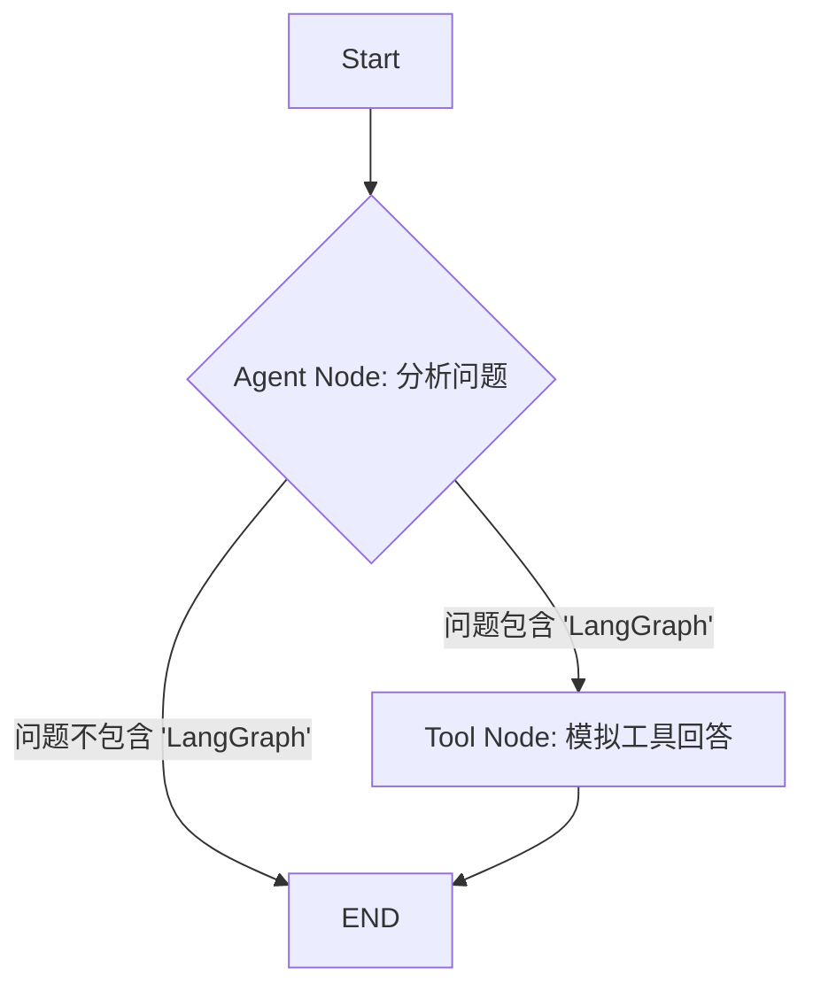

# 阶段一：实践项目 | 3.1. 构建简单问答机器人

**目标：** 将第一阶段学习的理论知识（State, Node, Edges）全部应用起来，从零开始构建一个完整的、可以运行的 LangGraph 应用。 

**项目描述：** 我们将创建一个简单的问答机器人。这个机器人会接收一个问题，然后做一个简单的判断：如果问题中包含 “LangGraph” 这个词，它就认为问题很“复杂”，需要调用一个（模拟的）工具来回答；否则，它就认为问题很“简单”，直接给出一个模板化的答案。

---

### 项目流程图

在动手写代码之前，我们先规划好工作流的蓝图。



---

### 分步实现指南

我们将按照以下步骤，一步步构建这个应用。**对应的代码示例文件是 `src/phase1_simple_chatbot.py`。**

#### 步骤 1: 导入必要的库

我们需要 `TypedDict` 来定义状态，以及 `StateGraph` 和 `END` 来构建图。

```python
import random
from typing import TypedDict, Literal
from langgraph.graph import StateGraph, END
```

#### 步骤 2: 定义图的状态 (State)

我们的 State 需要包含三个部分：
-   `question`: 存储用户提出的原始问题。
-   `answer`: 存储最终生成的答案。
-   `next_node`: 用于条件路由，告诉图下一步该去哪里。

```python
class SimpleBotState(TypedDict):
    """定义我们应用的状态"""
    question: str
    answer: str | None
    next_node: Literal["tool_node", "__end__"] # __end__ 是一个特殊的路由目标，代表结束
```

#### 步骤 3: 定义节点 (Nodes)

根据流程图，我们需要两个节点：`agent_node` 和 `tool_node`。

-   **`agent_node`**: 我们的“思考”节点。它负责分析问题并决定下一步的走向。
-   **`tool_node`**: 我们的“行动”节点。它负责模拟调用工具来回答复杂问题。

```python
def agent_node(state: SimpleBotState) -> dict:
    """分析问题，决定是直接回答还是使用工具。"""
    print("---AGENT NODE---")
    question = state["question"]

    if "langgraph" in question.lower():
        print("决策：问题复杂，需要使用工具。")
        # 返回对状态的更新，告诉路由函数下一步去 tool_node
        return {"next_node": "tool_node"}
    else:
        print("决策：问题简单，直接回答。")
        simple_answer = f"对 '{question}' 的简单回答是：这是一个秘密！"
        # 返回更新，包含答案并告诉路由函数结束
        return {"answer": simple_answer, "next_node": "__end__"}

def tool_node(state: SimpleBotState) -> dict:
    """模拟工具节点，处理复杂问题。"""
    print("---TOOL NODE---")
    question = state["question"]
    
    # 模拟工具查找答案
    tool_answer = f"通过工具查找到的答案是：LangGraph 是一个用于构建有状态 LLM 应用的库。"
    return {"answer": tool_answer}
```

#### 步骤 4: 定义条件路由函数

我们需要一个路由函数，它在 `agent_node` 执行后被调用，用来读取状态中的 `next_node` 字段，并告诉图具体该往哪条边走。

```python
def router(state: SimpleBotState) -> Literal["tool_node", "__end__"]:
    """根据 state['next_node'] 的值来决定路由方向。"""
    print("---ROUTER---")
    return state["next_node"]
```

#### 步骤 5: 构建并编译图

现在，我们将上面定义的状态、节点和路由函数组装成一个完整的图。

```python
# 1. 初始化 StateGraph
workflow = StateGraph(SimpleBotState)

# 2. 添加节点
workflow.add_node("agent", agent_node)
workflow.add_node("tool", tool_node)

# 3. 设置入口点
workflow.set_entry_point("agent")

# 4. 添加条件边
workflow.add_conditional_edges(
    "agent", # 决策从 agent 节点后开始
    router,  # 使用 router 函数进行决策
    {
        "tool_node": "tool", # 如果 router 返回 "tool_node", 则去 "tool" 节点
        "__end__": END       # 如果返回 "__end__", 则结束
    }
)

# 5. 添加常规边
# tool 节点执行完毕后，无条件结束
workflow.add_edge("tool", END)

# 6. 编译图
app = workflow.compile()
```

#### 步骤 6: 运行图并测试

我们准备两个测试用例，一个简单问题，一个复杂问题，来验证我们的图是否按预期工作。

```python
# --- 测试案例 1: 简单问题 ---
print("\n--- 开始测试简单问题 ---")
inputs1 = {"question": "你好吗？"}
final_state1 = app.invoke(inputs1)
print(f"最终答案: {final_state1['answer']}")

# --- 测试案例 2: 复杂问题 ---
print("\n--- 开始测试复杂问题 ---")
inputs2 = {"question": "请问什么是 LangGraph？"}
final_state2 = app.invoke(inputs2)
print(f"最终答案: {final_state2['answer']}")
```

---

### 总结

恭喜！你已经成功构建并运行了你的第一个 LangGraph 应用。通过这个项目，你应该已经对如何将 State、Nodes 和 Edges 结合起来解决实际问题有了切身的体会。这是后续学习更复杂 Agent 的坚实基础。

