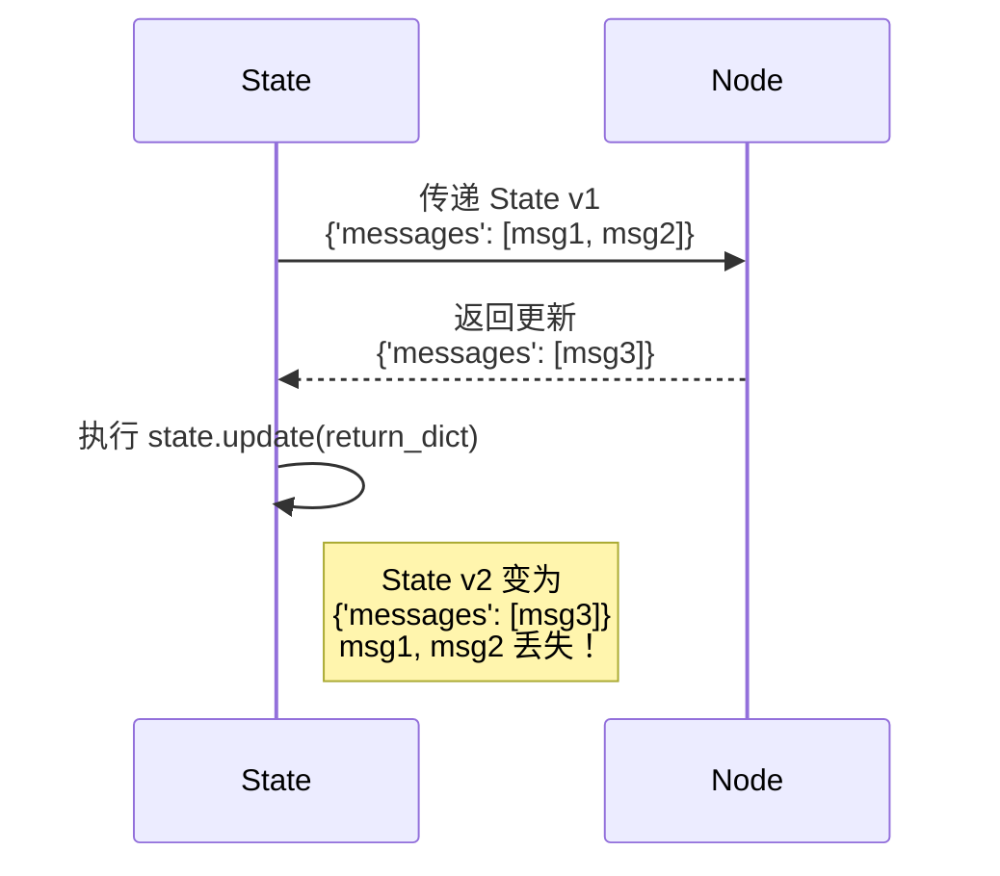
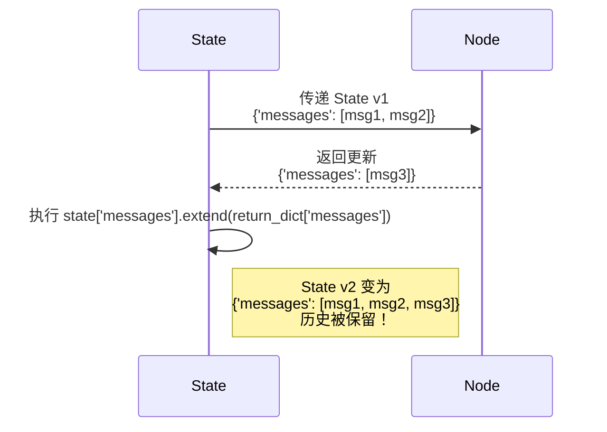

# 阶段二：状态管理 | 5.1. 详解状态累积

**目标：** 理解 LangGraph 默认的状态更新机制（替换），并掌握如何使用 `Annotated` 和 `operator.add` 将其转变为累积（追加）机制，这是构建能够记忆对话历史的 Agent 的核心。

---

## 状态更新的两种模式：替换 vs. 追加

在第一阶段，我们知道节点返回一个字典，LangGraph 会用这个字典来 `update` 主状态。对于简单的值（如字符串、数字），`update` 的行为就是**替换**。

**问题来了：** 如果我们的状态包含一个 `messages` 列表，用来存储对话历史，而一个节点返回了一个包含新消息的列表 `{"messages": [new_message]}`，那么默认的 `update` 行为会将整个 `messages` 列表替换为只包含 `new_message` 的新列表。旧的对话历史就丢失了！

这显然不是我们想要的。我们需要的是**追加**（Append/Extend），而不是替换。

### 图解：替换 vs. 追加

**默认行为：替换 (Replace)**


*图1: 默认的更新机制导致历史消息丢失。*

**期望行为：追加 (Append/Extend)**


*图2: 我们需要一种能保留并扩展列表的更新机制。*

--- 

## 解决方案: `Annotated` + `operator.add`

LangGraph 提供了一种优雅的、声明式的方式来实现追加模式，而无需我们手动去写 `extend` 逻辑。这就是通过 Python 的 `Annotated` 类型提示。

**如何工作？**

当你定义 State 的 `TypedDict` 时，你使用 `Annotated` 来“注解”你的列表类型。LangGraph 在编译图时会检查这些注解。如果它发现一个字段被注解为 `operator.add`，它就会改变对该字段的更新行为。

**从“替换”变为“追加”：**

```python
import operator
from typing import TypedDict, Annotated, List
from langchain_core.messages import AnyMessage

class AgentState(TypedDict):
    # 当 LangGraph 看到这个 Annotated 类型时，
    # 它就知道对 messages 字段的更新应该使用 `+` (add) 操作，
    # 而不是默认的 .update()。
    messages: Annotated[List[AnyMessage], operator.add]
```

现在，当一个节点返回 `{"messages": [new_message]}` 时，LangGraph 在内部会执行类似 `state["messages"] = state["messages"] + [new_message]` 的操作，从而实现了内容的追加。

--- 

## LLM 相关知识：对话历史的重要性

为什么保留对话历史如此重要？

LLM 本身是**无状态的**。它不会“记住”你上一轮跟它说了什么。为了让对话能够持续下去，我们必须在每次调用 LLM 时，将**全部的、到目前为止的对话历史**都作为上下文（Context）提供给它。

**一个典型的对话历史列表可能长这样：**

```python
[
    HumanMessage(content="你好"),
    AIMessage(content="你好！有什么可以帮你的吗？"),
    HumanMessage(content="帮我查查 LangGraph 是什么"),
    AIMessage(content="好的，我需要使用搜索工具。", tool_calls=[...]),
    ToolMessage(content="LangGraph 是一个库..."),
    # ... 接下来 LLM 会根据以上所有信息，生成最终答案
]
```

没有状态累积，Agent 就会“失忆”，无法进行多轮对话或多步推理。

--- 

## 相关 Python 语法详解

### 1. `typing.Annotated`

-   **语法**: `Annotated[BaseType, metadata1, metadata2, ...]`
-   **引入版本**: Python 3.9
-   **核心功能**: 它允许你将上下文无关的元数据（metadata）附加到任何类型上。这个元数据本身不做任何事，但它可以被其他库（比如 LangGraph, FastAPI, Pydantic）读取和解释。
-   **与 LangGraph 的关系**: LangGraph 就是 `Annotated` 元数据的一个“消费者”。它在编译时通过 Python 的 `get_type_hints` 函数来检查 State 定义，如果发现了 `operator.add` 这个元数据，就为该字段注册一个特殊的“累加”更新器。

### 2. `operator.add`

-   **语法**: `operator.add(a, b)`
-   **功能**: 这是一个函数，它实现了 `a + b` 的功能。它是一个通用的函数，可以作用于任何定义了 `__add__` 方法的对象。
-   **对于列表**: `operator.add([1, 2], [3])` 的结果是 `[1, 2, 3]`，等同于列表的拼接。
-   **与 LangGraph 的关系**: `operator.add` 本身很简单，但它作为一个可以被传递和引用的“对象”，恰好可以被放入 `Annotated` 的元数据槽中，作为一个清晰的、可读的“信号”，告诉 LangGraph：“请对这个字段使用加法更新！”

这种设计非常巧妙，因为它避免了硬编码或引入复杂的配置，而是利用了 Python 现代的类型系统来实现功能的切换，保持了代码的声明性和可读性。
