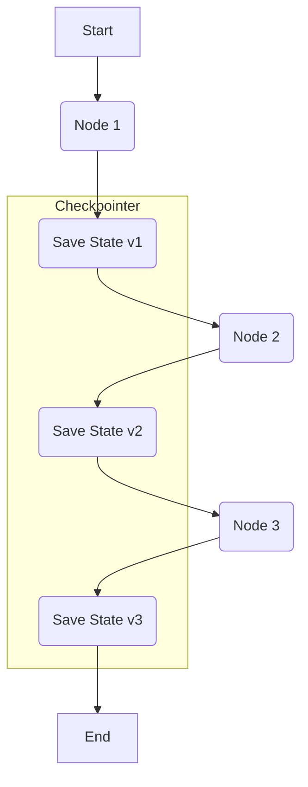

# 阶段三：可靠性 | 7.1. Checkpointer 持久化概念

**目标：** 理解为何需要持久化（Persistence），并掌握 LangGraph 的核心持久化机制 Checkpointer。同时，能够根据应用场景，在内存持久化（`MemorySaver`）和数据库持久化（`SqliteSaver`）之间做出正确的选择。

---

## 为什么需要持久化？Agent 的“记忆”

在之前的阶段，我们的 Agent 状态都只存在于程序的内存中。这意味着：
-   如果程序崩溃或重启，整个对话和思考过程都会丢失。
-   Agent 无法处理需要长时间运行、可能会被中断的任务。
-   我们无法回溯（Time-travel）到之前的某个状态来调试或重新运行。

**持久化**就是解决这个问题的关键。它允许我们将图在每一步执行后的**状态快照 (Snapshot)** 保存到一个可靠的存储中（如内存、文件或数据库）。

这个保存状态快照的机制，在 LangGraph 中被称为 **Checkpointer**。

### Checkpointer 带来的核心能力

1.  **断点续传**: 从上次中断的地方无缝恢复执行。
2.  **历史追溯**: 可以加载任意历史步骤的状态，进行调试或分析。
3.  **并发会话**: 为不同的用户或任务维护各自独立的状态历史。

*图1: Checkpointer 在每一步执行后都会保存状态快照。*

--- 

## LangGraph 的 Checkpointer 实现

LangGraph 提供了多种 Checkpointer 的实现，最常用的有两种：

1.  **`MemorySaver`**: 将所有状态快照保存在**内存**中。
2.  **`SqliteSaver`**: 将所有状态快照保存在一个 **SQLite 数据库文件**中。

### 如何选择？`MemorySaver` vs. `SqliteSaver`

| 特性 | `MemorySaver` | `SqliteSaver` |
| :--- | :--- | :--- |
| **存储位置** | 程序内存 (RAM) | 磁盘上的 `.sqlite` 文件 |
| **速度** | **极快**，因为没有磁盘 I/O | 较快，但有磁盘 I/O 开销 |
| **持久性** | **无**。程序结束后数据全部丢失 | **有**。程序重启后数据依然存在 |
| **适用场景** | - 快速原型开发 - 单元测试 - 不需要持久化记忆的短时任务 | - **生产环境** - 需要断点续传的长时任务 - 需要在多次运行间保持记忆的应用 - 需要支持多用户并发会话的应用 |
| **配置** | `MemorySaver()` | `SqliteSaver.from_conn_string(":memory:")` 或 `SqliteSaver.from_conn_string("my_db.sqlite")` |

**结论：**
-   在学习和开发阶段，`MemorySaver` 非常方便。
-   一旦你准备构建一个真正的、有用的应用，就应该立即切换到 `SqliteSaver`。

--- 

## 生态工具推荐：更强大的持久化方案

当你的应用规模变得更大，或者需要更复杂的查询和更高的并发性能时，可以考虑更专业的持久化后端：

-   **PostgreSQL**: 通过 `langchain-postgres` 库，你可以使用 `PostgresSaver` 将状态保存到强大的 PostgreSQL 数据库中。这对于需要处理大量并发用户、需要复杂查询和事务支持的企业级应用是最佳选择。
-   **Redis**: 通过 `langchain-redis` 库，你可以使用 `RedisSaver`。Redis 是一个高性能的内存数据库，也可以配置持久化到磁盘。它在需要极低延迟的状态读写场景中表现优异。

--- 

## LLM 相关知识：上下文窗口 (Context Window)

持久化与 LLM 的一个核心限制——**上下文窗口**——息息相关。

LLM 无法处理无限长的对话历史。每个模型都有一个最大的“上下文窗口”（例如 4k, 8k, 128k tokens）。如果对话历史太长，超出了这个窗口，你就必须想办法进行删减或总结，否则 API 会报错。

**Checkpointer 如何帮助我们？**

通过 Checkpointer，我们可以轻松地从持久化存储中加载完整的对话历史。在将其传递给 LLM 之前，我们可以实现一个“窗口化”逻辑：

1.  从数据库加载完整的 `messages` 列表。
2.  检查其总 token 数量。
3.  如果超过了模型的上下文窗口，就保留最新的 N 条消息，或者对最早的消息进行总结，生成一个摘要。
4.  将处理过的、长度合适的消息列表传递给 LLM。

这样，Agent 既能“记住”完整的历史，又不会因为超出上下文窗口而崩溃。

--- 

## 相关 Python 语法详解

### 1. 数据库连接字符串 (Connection String)

-   **语法**: `SqliteSaver.from_conn_string("my_checkpoints.sqlite")`
-   **概念**: 连接字符串是一个标准化的、用来描述如何连接到一个数据库的字符串。它包含了数据库类型、地址、文件名、认证信息等。
-   **SQLite 的特殊性**:
    -   `"my_checkpoints.sqlite"`: 这会告诉 `SqliteSaver` 在当前工作目录下创建（或连接到）一个名为 `my_checkpoints.sqlite` 的数据库文件。
    -   `":memory:"`: 这是一个特殊的 SQLite 连接字符串，它告诉 SQLite 在内存中创建一个数据库，而不是在磁盘上创建文件。它的行为和 `MemorySaver` 几乎一样，但底层使用的是 SQL 数据库引擎，有时在测试跨数据库兼容性时很有用。

### 2. 类的静态方法 (`@staticmethod` vs. `@classmethod`)

-   **语法**: `SqliteSaver.from_conn_string(...)` 是一个类方法。
-   **概念**: 
    -   **实例方法**: 最常见的方法，第一个参数总是 `self`，代表类的实例。`my_instance.my_method()`。
    -   **类方法 (`@classmethod`)**: 第一个参数是 `cls`，代表类本身。它通常用于创建工厂方法（Factory Methods），即返回一个类实例的方法，就像 `from_conn_string` 一样。你可以通过类本身直接调用它 `MyClass.my_class_method()`。
    -   **静态方法 (`@staticmethod`)**: 没有 `self` 或 `cls` 参数。它就像一个恰好被放在类命名空间下的普通函数，与类或实例的状态无关。
-   **为何 `from_conn_string` 是类方法？**: 因为它的工作是**创建**一个 `SqliteSaver` 的实例。你还没有实例，所以不能调用实例方法。通过类方法，你可以用一种清晰、语义化的方式来构造实例，而无需用户去关心 `__init__` 方法的内部细节。
