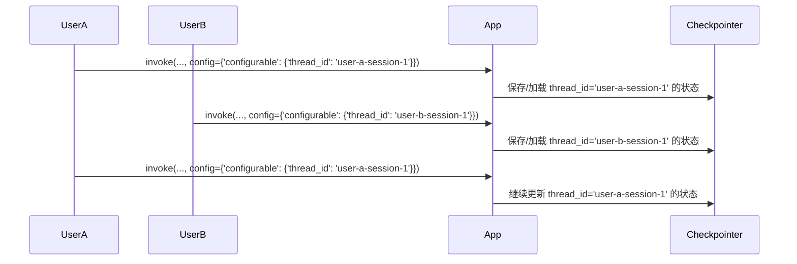

# 阶段三：可靠性 | 7.2. thread_id 与并发会话管理

**目标：** 理解 `thread_id` 在 LangGraph 持久化机制中的核心作用，并掌握如何使用它来管理独立的、并发的对话会话，这是构建多用户应用的基础。

---

## 问题：如何区分不同的对话？

当我们使用 Checkpointer（如 `SqliteSaver`）时，所有的状态快照都会被保存在同一个地方（例如，同一个数据库文件）。

那么问题来了：
-   如果用户 A 和用户 B 同时与我们的 Agent 对话，系统如何区分哪个状态属于 A，哪个状态属于 B？
-   如果同一个用户想开启一个全新的对话，而不受上一次对话历史的影响，该如何实现？

如果不能区分，所有用户的对话历史就会混在一起，造成灾难性的后果。

## `thread_id`: 对话的唯一标识符

LangGraph 的解决方案是引入一个**线程 ID (`thread_id`)** 的概念。

`thread_id` 是一个由你定义的、用于唯一标识一个**独立对话会话（Session）**的字符串。你可以把它想象成一个聊天应用的“会话 ID”或“频道 ID”。

-   所有拥有相同 `thread_id` 的调用，都被 LangGraph 认为是属于**同一个**对话流程。
-   拥有不同 `thread_id` 的调用，则被认为是完全**独立**的对话。

### `thread_id` 的工作流程


*图1: Checkpointer 使用 `thread_id` 作为主键来存取不同会话的状态，实现了完美的隔离。*

--- 

## API 用法: `configurable`

`thread_id` 是通过 `.invoke`, `.stream` 等方法中的 `config` 参数来传递的。这个 `config` 字典有一个固定的结构：`{"configurable": {"key": "value"}}`。

```python
# app = workflow.compile(checkpointer=my_checkpointer)

# 为用户 A 定义一个会话配置
config_user_a = {"configurable": {"thread_id": "user_a_convo_123"}}

# 为用户 B 定义一个会话配置
config_user_b = {"configurable": {"thread_id": "user_b_convo_456"}}

# 用户 A 的第一次调用
# app.invoke({"messages": [HumanMessage(content="Hi from A")]}, config=config_user_a)

# 用户 B 的调用，与 A 完全隔离
# app.invoke({"messages": [HumanMessage(content="Hi from B")]}, config=config_user_b)

# 用户 A 的第二次调用，会接着他自己的历史
# app.invoke({"messages": [HumanMessage(content="I am back")]}, config=config_user_a)
```

### 如何生成 `thread_id`？

`thread_id` 应该是一个唯一的字符串。在真实的应用中，通常可以这样生成：
-   在 Web 应用中，可以是用户的 `session_id`。
-   在聊天机器人中，可以是 `user_id` 和 `channel_id` 的组合。
-   对于临时会话，可以使用 `uuid` 模块生成一个随机的唯一 ID：`str(uuid.uuid4())`。

--- 

## 生态工具推荐：LangChain 的 `RunnableConfig`

你可能觉得 `{"configurable": {"thread_id": "..."}}` 这个结构有点长。实际上，这是 LangChain 表达式语言（LCEL）中标准的“可配置项”结构，称为 `RunnableConfig`。

LangChain 提供了一些辅助函数来更方便地构建这个配置，但直接使用字典是最基本和最透明的方式。

这个 `configurable` 字典不仅仅可以传递 `thread_id`，还可以传递其他用于配置 `Runnable` 对象的参数，例如：
-   `thread_ts`: 可以用来指定要回溯到某个具体的时间点，而不仅仅是最新状态。
-   自定义的回调函数、标签等，用于和 LangSmith 等监控平台深度集成。

--- 

## LLM 相关知识：多用户部署与 API Key 管理

当你构建一个多用户的 Agent 应用并准备部署时，`thread_id` 解决了会话隔离的问题，但另一个问题随之而来：**如何管理不同用户的 API 调用成本？**

如果你的应用直接使用你自己的 OpenAI Key，那么所有用户的调用都会算在你的账上。在生产环境中，这通常是不可行的。

**常见的解决方案：**
1.  **用户提供自己的 Key**: 在应用中允许用户输入并保存他们自己的 API Key。在处理该用户的请求时，动态地将他们的 Key 用于初始化 LLM 客户端。
2.  **代理与额度系统**: 构建一个中间层的 API 代理。用户向你的应用付费购买“额度”，你的应用在调用上游 LLM API 时，使用你自己的主 Key，但同时在你的系统内部扣除该用户的相应额度。

`thread_id` 在这两种方案中都扮演了关键角色，因为你需要用它来从数据库中查询到特定用户配置（如他们的 API Key 或剩余额度）。

--- 

## 相关 Python 语法详解

### 1. 嵌套字典 (Nested Dictionaries)

-   **语法**: `{"key1": {"key2": "value"}}`
-   **概念**: 字典的值本身也可以是另一个字典，从而形成层次结构。`configurable` 就是一个典型的嵌套字典。
-   **访问**: 你可以通过连续的方括号来访问内层的值，例如 `config["configurable"]["thread_id"]`。
-   **重要性**: 嵌套字典是组织复杂配置信息的常用方式。它避免了“扁平”命名空间中可能出现的键名冲突（例如，你自己可能也想用一个名为 `thread_id` 的顶级配置），并能将相关的配置项组合在一起，使得结构更清晰。

### 2. UUID (Universally Unique Identifier)

-   **模块**: `uuid` (Python 标准库的一部分)
-   **语法**: `import uuid; my_uuid = uuid.uuid4()`
-   **功能**: `uuid.uuid4()` 生成一个基于高质量随机数源的、全球唯一的 128 位标识符。两个 `uuid4()` 调用产生相同结果的概率可以忽略不计。
-   **应用场景**: 当你需要一个临时的、一次性的、但必须保证唯一的 ID 时，`uuid` 是完美的选择。例如，为一个匿名的网页访客创建一个临时的对话 `thread_id`。

```python
import uuid

def create_new_session_config():
    """为新会话创建一个唯一的配置""" 
    session_id = str(uuid.uuid4())
    print(f"创建新会话 ID: {session_id}")
    return {"configurable": {"thread_id": session_id}}

# 每次调用都会生成一个全新的、隔离的会话配置
config1 = create_new_session_config()
config2 = create_new_session_config()

# config1 和 config2 中的 thread_id 是不同的
assert config1["configurable"]["thread_id"] != config2["configurable"]["thread_id"]
```
