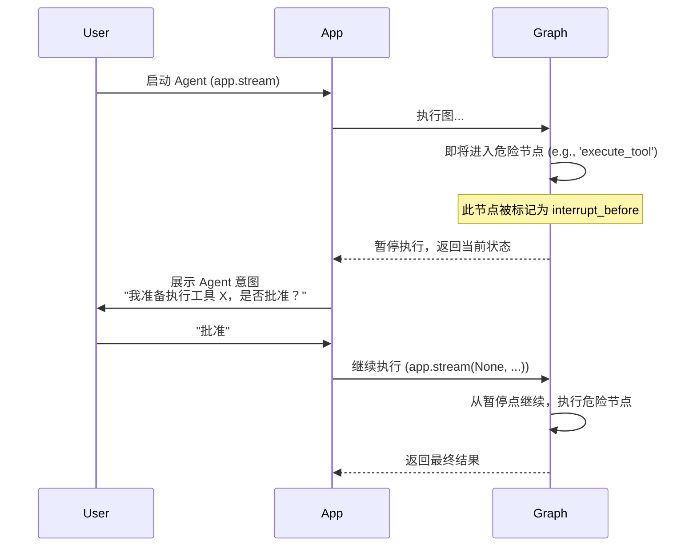

# 阶段三：可靠性 | 8.1. 人工干预 (Human-in-the-Loop)

**目标：** 理解“人工干预”在构建可信赖 Agent 中的重要性，并掌握如何使用 `interrupt_before` 参数在关键节点前暂停图的执行，等待用户确认。

---

## 为什么需要人工干预？

完全自主的 Agent 虽然强大，但也存在风险。在某些场景下，我们不希望 Agent 在没有监督的情况下执行一些关键的、不可逆的或高成本的操作。例如：

-   **执行破坏性操作**: 删除文件、关闭服务器。
-   **花费金钱**: 调用付费 API、下单购物。
-   **发送信息**: 以你的名义发送邮件或消息。
-   **处理敏感数据**: 在将敏感数据发送给外部服务前进行确认。

**人工干预 (Human-in-the-Loop, HITL)** 机制允许我们将人类的判断力无缝地集成到 Agent 的工作流中，在这些关键决策点上建立一个“安全审查”环节。

### HITL 的工作流程

LangGraph 的 HITL 机制依赖于 Checkpointer。流程如下：

1.  图正常执行，直到即将进入一个被标记为“需要中断”的节点。
2.  在执行该节点**之前**，图的执行被**暂停 (interrupt)**。
3.  此时，应用可以检查图的当前状态，并向用户展示 Agent 的“意图”。
4.  用户进行审查，并决定是“批准”还是“拒绝”。
5.  应用根据用户的决定，**继续 (continue)** 执行图的剩余部分，或者修改状态后继续，或者直接终止。


*图1: 人工干预的标准流程，在危险操作前暂停并等待用户批准。*

--- 

## 实现中断: `interrupt_before`

在 LangGraph 中，实现中断非常简单，只需要在 `compile()` 方法中传递 `interrupt_before` 参数即可。

**`interrupt_before`** 是一个包含节点名称字符串的列表。当图即将进入列表中的任何一个节点时，执行就会暂停。

**API 用法:**

```python
# from langgraph.checkpoint.memory import MemorySaver

# checkpointer 是实现中断的前提
# checkpointer = MemorySaver()

# 在编译时，告诉图在执行 "action" 节点前暂停
# app = workflow.compile(
#     checkpointer=checkpointer, 
#     interrupt_before=["action"] # 可以是 ["action", "another_node"]
# )
```

-   **依赖 Checkpointer**: 中断功能**必须**与一个 Checkpointer 一起使用。因为图需要通过 Checkpointer 来“记住”它暂停在了哪里，以便后续可以从同一点恢复。
-   **中断时机**: 中断发生在**节点执行之前**。这意味着当图暂停时，你检查状态，看到的是即将被该节点处理的状态。

--- 

## 生态工具推荐：构建交互式 CLI 和 Web 应用

人工干预的核心在于“交互”。你可以利用以下库来构建用户友好的交互界面：

-   **`rich`**: 一个强大的 Python 库，可以在终端中创建出彩色的、格式丰富的文本、表格和提示。非常适合构建需要用户输入的 CLI (命令行界面) Agent。
-   **`Streamlit` / `Gradio`**: 两个非常流行的 Python 库，可以让你用纯 Python 代码快速构建出简单的 Web UI。你可以用它们来展示 Agent 的状态，并提供“批准”/“拒绝”的按钮。
-   **`FastAPI` / `Flask`**: 对于更复杂的 Web 应用，你可以使用这些框架来构建后端 API。前端通过 API 调用来启动和继续 Agent 的执行，后端则管理 LangGraph 的状态和流程。

--- 

## LLM 相关知识：提高 Agent 的“可解释性”

为了让用户能够做出明智的批准/拒绝决策，Agent 必须能够清晰地解释它“为什么”想这么做。这被称为**可解释性 (Explainability)**。

仅仅让 Agent 输出 `{"tool_name": "delete_file", "args": {"path": "/tmp/data.csv"}}` 是不够的。一个好的 Agent 应该输出更具可解释性的内容。

**提升可解释性的 Prompt 技巧:**

在你的 Agent 的系统指令中，加入类似这样的要求：

> “当你决定要调用一个工具时，你必须在 `tool_calls` 之外，额外提供一个名为 `thought` 的字段。在这个字段中，用自然语言详细解释：
> 1.  你为什么需要调用这个工具？
> 2.  你期望从这个工具中获得什么结果？
> 3.  这个结果将如何帮助你回答用户的最终问题？”

通过这样的 Prompt Engineering，Agent 返回的状态会更丰富，当图暂停时，你就可以向用户展示这个 `thought` 字段，帮助用户做出更明智的决策。

--- 

## 相关 Python 语法详解

### 1. 列表作为参数 (Lists as Arguments)

-   **语法**: `interrupt_before=["action", "another_node"]`
-   **概念**: Python 函数和方法可以接受列表（或其他可迭代对象）作为参数。`compile` 方法的 `interrupt_before` 参数就期望接收一个字符串列表。
-   **灵活性**: 使用列表而不是单个字符串作为参数，使得 API 非常灵活。你可以轻松地设置一个、两个或多个中断点，而无需改变方法签名。

### 2. `input()` 函数

-   **语法**: `user_input = input("Please provide your feedback: ")`
-   **功能**: 这是 Python 内置的一个函数，用于在命令行中暂停程序执行，并等待用户输入一行文本。用户输入的内容（按回车键后）会以字符串的形式返回。
-   **应用**: 在构建简单的、基于终端的人工干预流程时，`input()` 是最直接的工具。

```python
# # 伪代码示例
# current_state = app.get_state(config)
# agent_action = current_state.values['messages'][-1].tool_calls[0]

# print(f"Agent 准备执行工具: {agent_action['name']}")
# print(f"参数: {agent_action['args']}")

# user_approval = input("是否批准？(yes/no): ")

# if user_approval.lower() == "yes":
#     # 继续执行
#     app.stream(None, config)
# else:
#     print("操作被用户取消。")
```

这个简单的 `input()` 循环是所有复杂交互界面（无论是 CLI 还是 Web）的原型。
