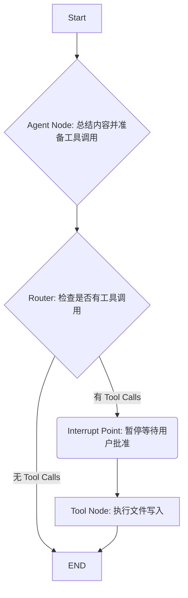

# 阶段三：实践项目 | 9.1. 构建带用户确认的 Agent

**目标：** 综合运用第三阶段学习的 Checkpointing 和中断机制，构建一个在执行“危险”操作前必须征得用户同意的 Agent。我们将使用一个**文件写入工具**，让“用户确认”这个步骤变得更有实际意义。

**项目描述：** 我们将构建一个“会议纪要员” Agent。用户可以给它一段会议内容，它会调用 LLM 来总结内容，然后准备将总结写入一个文件。在写入文件之前，它会暂停并等待用户确认，只有用户输入“yes”后，它才会真正地执行文件写入操作。

---

### 前置准备

1.  **安装必要的 Python 库:** (我们复用第二阶段的库)
    ```bash
    pip install langgraph langchain_core langchain-ollama langchain-openai
    ```
2.  **准备 LLM:** 确保你的 Ollama 服务正在运行并已拉取 `qwen3:4b` 模型。

---

### 项目流程图

这次的流程增加了一个明确的“人工干预”步骤。


*图1: 在 Tool Node 执行前，我们设置了一个中断点 D。*

---

### 分步实现指南

**对应的代码示例文件是 `src/phase3_human_in_the_loop.py`。**

#### 步骤 1: 导入与设置

```python
import os
import operator
import uuid
from typing import TypedDict, Annotated, List
from langchain_core.messages import AnyMessage, HumanMessage, ToolMessage, AIMessage
from langchain_core.tools import tool
from langchain_ollama.chat_models import ChatOllama
from langgraph.graph import StateGraph, END
from langgraph.checkpoint.sqlite import SqliteSaver
```

#### 2: 定义工具 (Tool)

这次我们定义一个“危险”的工具：向磁盘写入文件。

```python
@tool
def write_summary_to_file(filename: str, summary: str):
    """将会议总结写入指定的 Markdown 文件。"""
    with open(f"./{filename}", "w", encoding="utf-8") as f:
        f.write(summary)
    return f"文件 '{filename}' 已成功保存。"

tools = [write_summary_to_file]
```

#### 步骤 3: 定义 LLM 并绑定工具

```python
llm = ChatOllama(model="qwen3:4b", temperature=0)
llm_with_tools = llm.bind_tools(tools)
```

#### 步骤 4: 定义 Agent 状态

状态与第二阶段的项目完全相同，使用 `Annotated` 来累积消息。

```python
class AgentState(TypedDict):
    messages: Annotated[List[AnyMessage], operator.add]
```

#### 步骤 5: 定义图的节点和路由

这部分也和之前的项目类似。

```python
from langgraph.prebuilt import ToolNode

def agent_node(state: AgentState):
    print("---AGENT NODE---")
    return {"messages": [llm_with_tools.invoke(state['messages'])]}

tool_node = ToolNode(tools)

def router(state: AgentState) -> str:
    print("---ROUTER---")
    if state['messages'][-1].tool_calls:
        return "tools"
    return "__end__"
```

#### 步骤 6: 构建并编译**带中断的图**

这是本项目的核心！我们需要一个 Checkpointer，并在 `compile()` 时设置 `interrupt_before`。

```python
# 使用 SqliteSaver 来实现持久化，这样即使程序重启，状态也能恢复
memory = SqliteSaver.from_conn_string("checkpoints.sqlite")

workflow = StateGraph(AgentState)

workflow.add_node("agent", agent_node)
workflow.add_node("tools", tool_node)

workflow.set_entry_point("agent")
workflow.add_conditional_edges("agent", router)
workflow.add_edge("tools", "__end__") # 工具执行完就结束

# 编译图，并设置中断点！
# 我们告诉图，在即将执行 "tools" 节点之前，暂停。
app = workflow.compile(checkpointer=memory, interrupt_before=["tools"])
```

#### 步骤 7: 编写交互式运行逻辑

这是我们的主程序，它会处理与用户的交互。

```python
def run_agent():
    # 创建一个唯一的会话 ID
    session_id = str(uuid.uuid4())
    config = {"configurable": {"thread_id": session_id}}

    meeting_content = """
    会议主题：LangGraph 项目第三阶段规划
    参与者：AI 助手, 用户
    讨论内容：
    1. 确认需要加入人工干预机制。
    2. 决定使用文件写入工具作为“危险操作”的示例。
    3. 用户希望在文档中看到更多热门工具的介绍。
    结论：按计划进行，创建带用户确认的 Agent 项目。
    """
    
    initial_prompt = f"请帮我总结以下会议内容，并将其保存到名为 'meeting_summary.md' 的文件中。\n\n会议内容：\n{meeting_content}"
    inputs = {"messages": [HumanMessage(content=initial_prompt)]}

    print(f"--- 开始新会话 (ID: {session_id}) ---")
    # 第一次调用，图会运行直到中断点
    for event in app.stream(inputs, config, stream_mode="values"):
        event["messages"][-1].pretty_print()

    # --- 人工干预环节 ---
    # 使用 get_state 检查当前状态
    current_state = app.get_state(config)
    last_message = current_state.values['messages'][-1]
    tool_call = last_message.tool_calls[0]

    print("\n--- AGENT 已暂停 ---")
    print(f"Agent 准备调用工具: {tool_call['name']}")
    print(f"参数: {tool_call['args']}")

    while True:
        user_approval = input("是否批准执行此操作？ (yes/no): ")
        if user_approval.lower() in ["yes", "no"]:
            break

    if user_approval.lower() == "yes":
        print("--- 用户已批准，继续执行 ---")
        # 再次调用 stream，传入 None 来继续执行
        for event in app.stream(None, config, stream_mode="values"):
            event['messages'][-1].pretty_print()
    else:
        print("--- 用户已拒绝，操作取消 ---")

if __name__ == "__main__":
    run_agent()
```

#### 步骤 8: 运行与验证

1.  在终端运行 `python src/main_v3.py`。
2.  你会看到 Agent 输出了它的思考过程，并准备调用 `write_summary_to_file` 工具。
3.  程序会暂停，并询问你是否批准。
4.  输入 `yes` 并回车。你会看到工具被执行，并打印出成功保存文件的消息。
5.  检查你的 `src` 文件夹，你会发现多了一个 `meeting_summary.md` 文件，里面包含了 LLM 生成的会议纪要。
6.  再次运行程序，然后输入 `no`。你会看到程序直接退出，并且没有创建文件。

---

### 总结

恭喜！你成功构建了一个更可靠、更安全的 Agent。通过 Checkpointer 和 `interrupt_before`，你学会了如何在自主的 AI 工作流中加入人类的智慧和判断力，这是将 Agent 应用于真实世界关键任务的重要一步。

