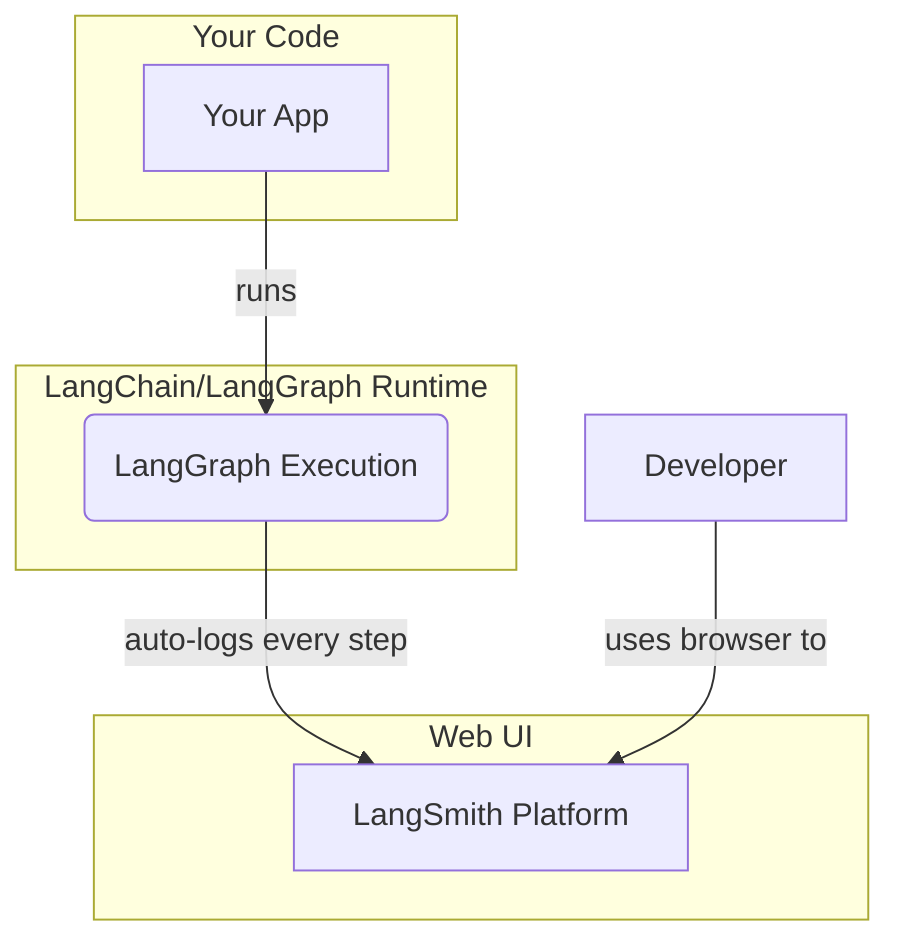

# 阶段四：高级技巧 | 10.1. LangSmith 的核心价值

**目标：** 理解为何需要一个专门的工具来调试和追踪 LLM 应用，并掌握 LangSmith 的核心价值主张：可视化追踪、监控与评估。

---

## LLM 应用的调试之痛

传统的软件开发有成熟的调试工具：断点、堆栈跟踪、日志文件。但这些工具在调试 LLM 应用时，效果非常有限。因为 LLM 应用有其独特的难题：

1.  **不确定性 (Non-determinism):** 即使输入相同，LLM 的输出也可能因为 `temperature` 设置或模型更新而变化。
2.  **复杂的中间步骤:** 一个 Agent 的最终输出，可能经历了多次 LLM 调用、工具调用和逻辑判断。这些中间步骤像一个“黑箱”，如果最终结果不理想，很难定位是哪一步出了问题。
3.  **Prompt 的“玄学”:** “我的 Prompt 到底写得好不好？”“LLM 到底看到了什么最终的输入？”——这些问题很难通过简单的 `print` 语句来回答。
4.  **评估困难:** 如何量化地评估一个 Agent 的表现？如何知道一个新的 Prompt 或模型版本是否真的带来了提升？

传统的日志工具只能记录离散的事件，无法清晰地展现这些复杂、嵌套的调用链关系。

## LangSmith: LLM 应用的“飞行记录仪”

LangSmith 是 LangChain 团队专门为解决上述痛点而打造的一个平台。你可以把它想象成 LLM 应用的“飞行记录仪”或“全链路追踪系统”。

只要你在代码中设置了几个环境变量，LangChain/LangGraph 的每一次执行，其内部所有的调用细节——从最顶层的图，到每一次 LLM 调用，再到每一次工具调用——都会被自动捕获并发送到 LangSmith 服务器，以一种高度可视化的方式呈现给你。

### LangSmith 的核心功能

1.  **可视化追踪 (Tracing):**
    -   将复杂的 Agent 执行过程以**树状结构**清晰地展现出来。
    -   你可以看到每个节点的**输入/输出**、**耗时**、**Token 数量**。
    -   对于 LLM 调用，你可以一目了然地看到发送给模型的**完整 Prompt**、模型的返回、以及任何工具调用请求。

2.  **监控与调试 (Monitoring & Debugging):**
    -   集中查看所有运行的错误、延迟和成本。
    -   快速筛选出失败的、或者表现异常的运行实例，并深入其轨迹进行调试。

3.  **评估 (Evaluation):**
    -   创建一个数据集（输入/输出对），并让你的 Agent 在这个数据集上运行。
    -   使用 AI 辅助的评估器（Evaluator）或自定义的评估逻辑，来量化地评估 Agent 在准确性、相关性等方面的表现。
    -   这是进行 A/B 测试（例如，比较不同 Prompt 或模型）的强大工具。

### LangSmith 在开发流程中的位置


*图1: LangSmith 作为一个独立的平台，自动接收并可视化你的应用在运行时的所有内部细节。*

--- 

## 如何启用 LangSmith？

启用 LangSmith 非常简单，你只需要做两件事：

1.  **创建项目:** 前往 [LangSmith 官网](https://smith.langchain.com/) 注册并创建一个项目 (Project)。
2.  **设置环境变量:** 在你的 Python 环境中设置三个环境变量。

```bash
# 告诉 LangChain 开始追踪
export LANGCHAIN_TRACING_V2="true"

# 你的 LangSmith API Key (在官网设置页面可以找到)
export LANGCHAIN_API_KEY="ls__..."

# (可选) 你想将运行记录发送到哪个项目
export LANGCHAIN_PROJECT="My Agent Project"
```

完成以上设置后，**无需修改任何一行 LangGraph 代码**，你的下一次运行就会自动出现在 LangSmith 的仪表盘上。

--- 

## 相关 Python 语法详解

### 1. 环境变量 (Environment Variables)

-   **概念**: 环境变量是操作系统级别（而不是 Python 程序内部）的、以 `键=值` 形式存在的动态变量。程序可以从其运行的环境中读取这些变量。
-   **优点**: 
    -   **配置与代码分离**: 它允许你将配置（如 API Keys, 项目名称）与你的代码逻辑分离开来。你的代码可以保持通用，并通过修改环境变量来适应不同的部署环境（开发、测试、生产）。
    -   **安全性**: 是存储 API Key 等敏感信息的标准方式，避免将其硬编码到代码中而意外泄露。
-   **在 Python 中设置 (不推荐)**: 虽然你可以用 `os.environ["KEY"] = "VALUE"` 在 Python 脚本中设置环境变量，但这通常只对当前运行的子进程有效，不是一个好的实践。最佳实践是在运行脚本**之前**，在你的 Shell（如 Bash, PowerShell）中设置它们。

### 2. `export` 命令 (Bash/Zsh)

-   **语法**: `export VAR_NAME="value"`
-   **功能**: 这是在 Unix-like 系统（Linux, macOS）的终端中设置环境变量的标准命令。`export` 命令不仅创建了一个变量，还会将其“导出”，使得从这个 Shell 启动的任何子进程（包括你的 Python 脚本）都能继承并看到这个变量。
-   **Windows 等价命令**:
    -   **CMD**: `set VAR_NAME="value"`
    -   **PowerShell**: `$env:VAR_NAME="value"`

理解如何根据你的操作系统正确地设置环境变量，是使用 LangSmith 和许多其他需要 API Key 的云服务的第一步。
